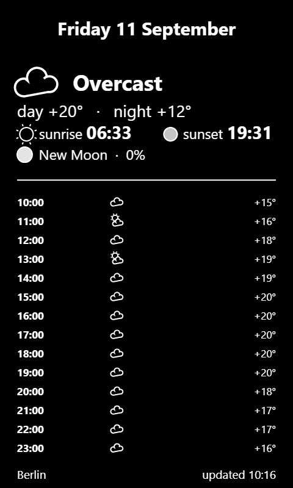

# Xteink Meteo Sleep 🌙

**[👉 Open the web app](https://aktogde1.github.io/xteink-meteo-sleep/?lang=en)**

Weather, moon phase, and sunrise/sunset on the lock screen of **Xteink X4 / X3** e-readers (**inkMOD** / **CrossPoint** firmware).

## What is it

A web generator: pick your city → it assembles a black-and-white card, sized exactly for your e-reader's screen → you download `sleep.bmp`. A single HTML file, no libraries, no servers.

On the card: weekday and date, current conditions (icon + wording), an hourly forecast for the rest of today (temperature, weather icon and precipitation chance — what tomorrow brings, you'll learn tomorrow), "day / night" temps, sunrise and sunset, moon phase as a text line (name + illumination %), city and update time. Light / dark card switch included. Exactly 2 colors — perfect for e-ink.

Interface languages: **English · Русский** — auto-detected from your browser (switcher in the header).

> **Want live self-hosted dashboards instead?** If flashing custom firmware and running a small home server is your thing, look at [Tesserae](https://github.com/dmellok/tesserae) + [CrossInk](https://github.com/dmellok/CrossInk). This tool is the other route: no firmware, no server — just a `sleep.bmp` from a web page.

## Quick start

1. Open the [web app](https://aktogde1.github.io/xteink-meteo-sleep/?lang=en)
2. Enter your city → pick your device (X4 / X3)
3. **"Download sleep.bmp"** → put the file into the `Sleep` folder on the microSD, overwriting the one already there
4. Set the sleep screen mode to "Custom image". Lock the reader — the card is on screen ✅

## One-click install (from a computer)

Download [`index.html`](https://raw.githubusercontent.com/aktogde1/xteink-meteo-sleep/main/index.html) and open it on your laptop — a **"Update & install to reader"** button appears:

1. Reader — in File Transfer mode (on inkMOD: hold the power button, the server is up in ~20 s)
2. Laptop — on the same Wi-Fi network (or on the reader's `InkMOD-Reader` hotspot, address `http://192.168.4.1`)
3. The reader address is pre-filled (the one shown on its screen) — press the button → the image flies to the reader and the "Custom image" mode is set automatically

The page also auto-detects a tiny local relay (if you serve it through one) and routes the upload through it — same button, same result.

**Even simpler:** download [`meteo-server.bat`](meteo-server.bat) (and [`serve.py`](serve.py) next to it) and run the bat — it starts a local server and opens the page where one-click install works without any browser restrictions (Python required).

> **Why doesn't the button work on the online version?** The web app is served over HTTPS while the reader lives on your home network over HTTP. Browsers block those requests (mixed content) — there is no way around it. The local file is fully featured.

## Devices

| Button | Resolution |
|---|---|
| X4 | 480×800 |
| X3 | 480×640 |

## Under the hood

- One `index.html` file, plain JS + canvas, no libraries, no build step
- Weather, forecast, sunrise/sunset — [Open-Meteo](https://open-meteo.com/) (open API, no sign-up); city — their geocoder
- Moon phase — synodic cycle math (29.53 days from the reference new moon on 2000-01-06)
- The BMP is hand-written in JS: 24-bit, bottom-up, luminance threshold 140 → exactly 2 colors
- Install to reader: `POST /upload?path=/Sleep` (multipart, field `file`) + `POST /api/settings` `{"sleepScreen":3}` — index 3 = "Custom image" on inkMOD 1.1.x. Served through a local relay? The page detects it via `/relay-check` and sends through it; otherwise the upload goes directly to the reader

## Compatibility

Tested on Xteink X4 + inkMOD 1.1.7. CrossPoint and X3 are supported via sizes and the manual route; feedback welcome.

## Support the project ♥

If the generator was useful — you can [donate via Tribute](https://web.tribute.tg/d/Q5J) (Telegram). Not required, but much appreciated 🙂

**Crypto:**

- USDT (TRC20): `TXkyArvXBQyFqSMcfK7pFeeaCyaYgenUg1` — [QR](https://qr.crypt.bot/?url=TXkyArvXBQyFqSMcfK7pFeeaCyaYgenUg1)
- BTC: `bc1qyp7rcyasjk6k0eh84qc8wvveaptyqnkmmt33p6` — [QR](https://qr.crypt.bot/?url=bc1qyp7rcyasjk6k0eh84qc8wvveaptyqnkmmt33p6)
- ETH: `0x68ba5c4b009579525fac3318AcD4Ec00938C5Ca4` — [QR](https://qr.crypt.bot/?url=0x68ba5c4b009579525fac3318AcD4Ec00938C5Ca4)

## Development

The whole app is a single `index.html` — but it has a map. See **[DEVELOPMENT.md](DEVELOPMENT.md)** for the code layout, a "where do I change …" cheat table, known gotchas and the release flow. The project idea is shown on the site itself (the 💡 section).

## License

MIT. Not affiliated with Xteink, inkMOD or CrossPoint. Weather data — Open-Meteo (non-commercial use).
