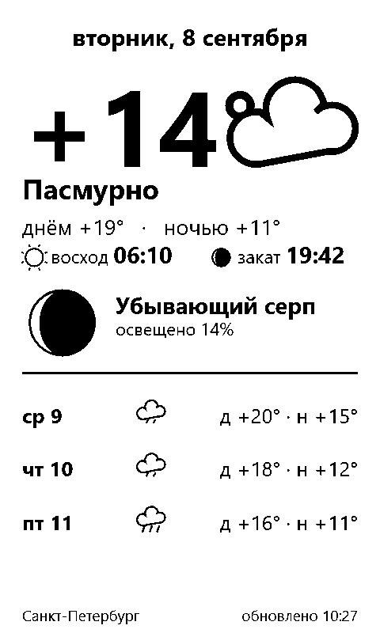

# Xteink Meteo Sleep 🌙

**[👉 Открыть сайт](https://aktogde1.github.io/xteink-meteo-sleep/)**

Погода, фаза Луны и восход/закат на экране сна ридеров **Xteink X4 / X3** (прошивки **inkMOD** и **CrossPoint**).

## Что это

Сайт-генератор: выбираешь город → он собирает чёрно-белую карточку ровно под экран ридера → скачиваешь `sleep.bmp`. Один HTML-файл, без библиотек и серверов.

На карточке: дата и день недели, погода сейчас + «днём / ночью», прогноз на 2–5 дней (`д` — днём, `н` — ночью), восход и закат, фаза Луны строчкой (название + процент освещённости), город и время обновления. Переключатель светлой/тёмной карточки. Ровно 2 цвета — идеально для e-ink.

**🌐 Языки интерфейса:** Русский · English — определяются автоматически, переключаются кнопками в шапке.

## Быстрый старт

1. Открой [сайт](https://aktogde1.github.io/xteink-meteo-sleep/)
2. Введи город → выбери устройство (X4 / X3)
3. **«Скачать sleep.bmp»** → файл в папку `Sleep` на microSD, перезапиши тот, что там лежит
4. Режим экрана сна на ридере — «Своя картинка». Заблокировал ридер — карточка на экране ✅

## Установка в один клик (с компьютера)

Скачай [`index.html`](https://raw.githubusercontent.com/aktogde1/xteink-meteo-sleep/main/index.html) и открой его на ноуте — появится кнопка **«Обновить и установить на ридер»**:

1. Ридер — в режим передачи файлов (в inkMOD — удержание кнопки питания, сервер встаёт за ~20 сек)
2. Ноут — в ту же Wi-Fi сеть (или в точку доступа ридера `InkMOD-Reader`, адрес `http://192.168.4.1`)
3. Адрес ридера подставится сам (тот, что он показывает на экране) — жми кнопку → картинка летит на ридер, режим «Своя картинка» выставляется автоматически

Если сайт открыт через крошечный локальный релей (например, `.bat`-лаунчер), страница обнаруживает его автоматически и шлёт файл через него — та же кнопка, тот же результат.

> **Почему кнопка не работает на онлайн-версии?** Сайт на GitHub Pages — по HTTPS, а ридер в домашней сети — по HTTP. Браузеры блокируют такие запросы (mixed content), обойти нельзя. Локальный файл — полноценный, без ограничений.

## Устройства

| Кнопка | Разрешение |
|---|---|
| X4 | 480×800 |
| X3 | 480×640 |

## Технически

- Один файл `index.html`, чистый JS + canvas, без библиотек и сборки
- Погода, прогноз, восход/закат — [Open-Meteo](https://open-meteo.com/) (открытый API без регистрации); город — их геокодер
- Фаза Луны — синодический цикл 29,53 сут от опорного новолуния 06.01.2000
- BMP пишется вручную в JS: 24 бита, bottom-up, порог яркости 140 → ровно 2 цвета
- Установка на ридер: `POST /upload?path=/Sleep` (multipart, поле `file`) + `POST /api/settings` `{"sleepScreen":3}` — индекс 3 = «Своя картинка» в inkMOD 1.1.x. Если сайт открыт через локальный релей, страница находит его через `/relay-check` и шлёт через него; иначе файл уходит напрямую на ридер

## Совместимость

Проверено на Xteink X4 + inkMOD 1.1.7. CrossPoint и X3 — поддерживаются размерами и ручным способом; фидбек приветствуется.

## ♥ Поддержать автора

Если генератор тебе пригодился — можно поддержать разработку через [Tribute](https://web.tribute.tg/d/Q5J) (Telegram). Это необязательно, но приятно 🙂

**Криптой:**

- USDT (TRC20): `TXkyArvXBQyFqSMcfK7pFeeaCyaYgenUg1` — [QR](https://qr.crypt.bot/?url=TXkyArvXBQyFqSMcfK7pFeeaCyaYgenUg1)
- BTC: `bc1qyp7rcyasjk6k0eh84qc8wvveaptyqnkmmt33p6` — [QR](https://qr.crypt.bot/?url=bc1qyp7rcyasjk6k0eh84qc8wvveaptyqnkmmt33p6)
- ETH: `0x68ba5c4b009579525fac3318AcD4Ec00938C5Ca4` — [QR](https://qr.crypt.bot/?url=0x68ba5c4b009579525fac3318AcD4Ec00938C5Ca4)

## Разработка

Весь сайт — один `index.html`, и у него есть карта. Смотри **[DEVELOPMENT.md](DEVELOPMENT.md)**: структура кода, шпаргалка «где что править», известные грабли и процесс релиза. Идея проекта — на сайте (секция 💡).

## Лицензия

MIT. Автор не связан с Xteink, inkMOD или CrossPoint. Погода — Open-Meteo (некоммерческое использование).
