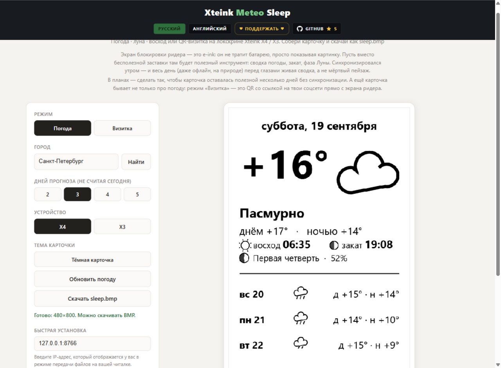

# Xteink Meteo Sleep 🌙

**[👉 Открыть сайт](https://aktogde1.github.io/xteink-meteo-sleep/)**

Погода, задачи на день, фаза Луны и восход/закат — или QR-визитка — на экране сна ридеров **Xteink X4 / X3** (прошивки **inkMOD** и **CrossPoint**). Макет X4 также подходит для X4C и X4 Pro.

## Что это

Генератор в браузере: выбираешь город, добавляешь задачи на сегодня, указываешь модель ридера и скачиваешь готовый `sleep.bmp`. Это один HTML-файл без сборки, регистрации и серверной части.

На карточке: дата и день недели, дневной максимум, ночная температура, описание погоды, восход и закат, фаза Луны, задачи на день, город и время обновления. Карточка использует ровно два цвета для чёткого отображения на e-ink.

Задачи хранятся только в текущем браузере. Макет X4 показывает до 5 задач, X3 — до 3. Задачи можно перетаскивать, отмечать выполненными и удалять. На карточку попадают первые задачи из списка.

**🌐 Языки интерфейса:** Русский · English — определяются автоматически, переключаются кнопками в шапке.

**Режим «QR-визитка»:** большой QR-код по центру экрана со ссылкой на профиль, канал или сайт. Выбери «Тип карточки → QR-визитка», вставь ссылку и скачай `sleep.bmp`. QR создаётся локально встроенной библиотекой [qrcode-generator](https://github.com/kazuhikoarase/qrcode-generator) (MIT, ~20 КБ).

> **Нужны живые self-hosted дашборды?** Если не пугает перепрошивка и свой маленький сервер — посмотрите [Tesserae](https://github.com/dmellok/tesserae) + [CrossInk](https://github.com/dmellok/CrossInk). Этот инструмент — противоположный путь: без прошивки и сервера, просто `sleep.bmp` из веб-страницы.

## Быстрый старт

1. Открой [сайт](https://aktogde1.github.io/xteink-meteo-sleep/)
2. Введи город и нажми **«Найти»**
3. Добавь задачи на сегодня и расставь их в нужном порядке
4. Выбери X4 или X3 и нажми **«Обновить прогноз»**. Для X4C и X4 Pro тоже выбирай X4
5. Нажми **«Скачать sleep.bmp»**, затем скопируй файл в папку `Sleep` на microSD с заменой старого
6. Выбери на ридере режим **«Своя картинка»** и заблокируй экран

## Установка в один клик (с компьютера)

Скачай [`index.html`](https://raw.githubusercontent.com/aktogde1/xteink-meteo-sleep/main/index.html) и открой его на ноутбуке. Используй кнопку **«Обновить карточку и установить»**:

1. Ридер — в режим передачи файлов (в inkMOD — удержание кнопки питания, сервер встаёт за ~20 сек)
2. Ноут — в ту же Wi-Fi сеть (или в точку доступа ридера `InkMOD-Reader`, адрес `http://192.168.4.1`)
3. Адрес ридера подставится сам (тот, что он показывает на экране) — жми кнопку → картинка летит на ридер, режим «Своя картинка» выставляется автоматически

Если сайт открыт через крошечный локальный релей, страница обнаруживает его автоматически и шлёт файл через него — та же кнопка, тот же результат.

**Ещё проще:** скачай [`meteo-server.bat`](meteo-server.bat) (и [`serve.py`](serve.py) рядом) и запусти батник — он поднимет локальный сервер и откроет сайт, где установка в один клик работает без ограничений браузера (нужен Python).

> **Почему кнопка не работает на онлайн-версии?** Сайт на GitHub Pages — по HTTPS, а ридер в домашней сети — по HTTP. Браузеры блокируют такие запросы (mixed content), обойти нельзя. Локальный файл — полноценный, без ограничений.

## Устройства

| Кнопка | Разрешение |
|---|---|
| X4 (X4 / X4C / X4 Pro) | 480×800 |
| X3 | 480×640 |

## Технически

- Один файл `index.html`, чистый JS + canvas, без сборки; единственная вшитая библиотека — `qrcode-generator` (MIT, ~20 КБ в минифицированном виде) для офлайн-генерации QR в режиме «Визитка»
- Погода, дневная и ночная температуры, восход и закат — [Open-Meteo](https://open-meteo.com/) (открытый API без регистрации); город — их геокодер
- Задачи — `localStorage` браузера, без аккаунта и облачной синхронизации
- Фаза Луны — синодический цикл 29,53 сут от опорного новолуния 06.01.2000
- BMP пишется вручную в JS: 24 бита, bottom-up, порог яркости 140 → ровно 2 цвета
- Установка на ридер: `POST /upload?path=/Sleep` (multipart, поле `file`) + `POST /api/settings` `{"sleepScreen":3}` — индекс 3 = «Своя картинка» в inkMOD 1.1.x. Если сайт открыт через локальный релей, страница находит его через `/relay-check` и шлёт через него; иначе файл уходит напрямую на ридер

## Совместимость

Проверено на Xteink X4 + inkMOD 1.1.7. Размер X4 также подходит для X4C и X4 Pro. CrossPoint и X3 поддерживаются размерами карточки и ручным способом; фидбек приветствуется.

## ♥ Поддержать автора

Если генератор тебе пригодился — можно поддержать разработку через [Tribute](https://web.tribute.tg/d/Q5J) (Telegram). Это необязательно, но приятно 🙂

**Криптой:**

- USDT (TRC20): `TXkyArvXBQyFqSMcfK7pFeeaCyaYgenUg1` — [QR](https://qr.crypt.bot/?url=TXkyArvXBQyFqSMcfK7pFeeaCyaYgenUg1)
- BTC: `bc1qyp7rcyasjk6k0eh84qc8wvveaptyqnkmmt33p6` — [QR](https://qr.crypt.bot/?url=bc1qyp7rcyasjk6k0eh84qc8wvveaptyqnkmmt33p6)
- ETH: `0x68ba5c4b009579525fac3318AcD4Ec00938C5Ca4` — [QR](https://qr.crypt.bot/?url=0x68ba5c4b009579525fac3318AcD4Ec00938C5Ca4)

## Разработка

Весь сайт — один `index.html`, и у него есть карта. Смотри **[DEVELOPMENT.md](DEVELOPMENT.md)**: структура кода, шпаргалка «где что править», известные грабли и процесс релиза. Идея проекта — на сайте (секция 💡).

## Лицензия

MIT. Автор не связан с Xteink, inkMOD или CrossPoint. Погода — Open-Meteo (некоммерческое использование).
